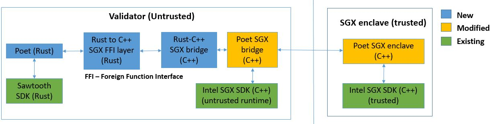

High level design

This directory contains the sgx related code for PoET2 consensus engine.

* rust_sgxffi - Rust APIs for the SGX enclave
* rust_sgx_bridge - Rust-C++ SGX bridge code
* libpoet_bridge, poet_enclave_sgx - Enclave code (untrusted)
* libpoet_enclave - Enclave code (trusted)
* testEnclave - Unit test code for enclave
* libpoet_shared - Shared Utility functions

Below are the steps to build and run PoET2 SGX Enclave with SGX HW mode using docker

1. Make sure the host setup has enabled the SGX in BIOS configuration
2. Install below packages on the host setup. This is needed to install SGX binaries
	1. sudo apt-get update
	2. sudo apt-get install -q -y \
			autoconf \
			automake \
			build-essential \
			libcurl4-openssl-dev \
			libprotobuf-dev \
			libssl-dev \
			libtool \
			libxml2-dev \
			ocaml \
			pkg-config \
			protobuf-compiler \
			unzip \
			uuid-dev \
			wget \
			libelf-dev \
			docker \
			docker-compose \

3. Install SGX driver and libsgx-common deb package on the host setup
	1. wget https://download.01.org/intel-sgx/linux-2.3/ubuntu16.04-server/sgx_linux_x64_driver_4d69b9c.bin
	2. chmod +x sgx_linux_x64_driver_4d69b9c.bin
	3. sudo ./ sgx_linux_x64_driver_4d69b9c.bin

	4. wget https://download.01.org/intel-sgx/linux-2.3/ubuntu16.04-server/libsgx-enclave-common_2.3.100.46354-1_amd64.deb
	5. dpkg –I https://download.01.org/intel-sgx/linux-2.3/ubuntu16.04-server/libsgx-enclave-common_2.3.100.46354-1_amd64.deb

4. Make sure host machine has device mapping /dev/isgx (Execute the command ls -l /dev/isgx and check if /dev/isgx is present)
5. Run PoET using docker-compose -> sudo docker-compose -f docker-compose-sgx-hw.yaml up

Steps to build PoET2 SGX Enclave in standalone mode in SIMUATOR mode
NOTE: Below steps are not needed for docker builds. Only applicable for standalone development builds

1. Install SGX binaries
	1. Download SGX SDK binary from below link
	   https://download.01.org/intel-sgx/linux-2.3/ubuntu16.04-server/sgx_linux_x64_sdk_2.3.100.46354.bin
	2. assign exec permission to binary and execute
		* *chmod +x sgx_linux_x64_sdk_2.3.100.46354.bin*
		* *./sgx_linux_x64_sdk_2.3.100.46354.bin*
	3. set SGX SDK lib path
		* *chmod +x <SGX_bin_path>/sgxsdk/environment*
		* *source <SGX_bin_path>/sgxsdk/environment*

2.  Install libclang-dev and libjson-c-dev libraries
	* *apt-get install libclang-dev/libjson-c-dev*

3. Build SGX code
	1. Create build folder and build SGX code
	   * *mkdir <sawtooth-poet-home>/src/build*
	   * *cd  <sawtooth-poet-home>/src/build/*
	2. *cmake ../sgx*
	3. *make*

Steps to run Unit test
1. Set SGX binary path
	* *export LD_LIBRARY_PATH=$LD_LIBRARY_PATH:<sawtooth-poet-home>/src/build/bin*

2. Execute unit tests using cargo
	1. *cd <sawtooth-poet-home>/sawtooth-poet/src/sgx/rust_sgxffi*
	2. *cargo test -- --nocapture*

3. Execute C++ unit test cases
    1. *cd <sawtooth-poet-home>/src/build/bin*
    2. *./testEnclave*
